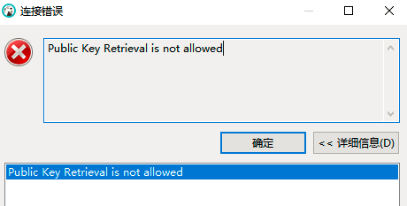
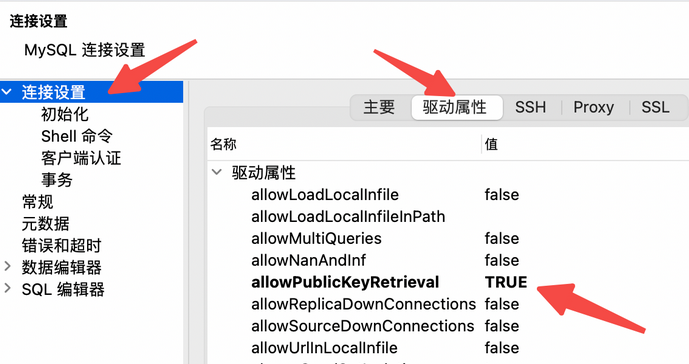

# Docker

## MySQL

MySQL镜像安装安装后通过命令启动：
```shell
docker run -p 13306:3306 --name mysql -e MYSQL_ROOT_PASSWORD=root -d mysql/mysql-server
```

之后连接到mysql服务器，出现认证错误，需要修改user表信息。

```mysql
select host, User, plugin from user where User = 'root';
update user set host = '%' where user = 'root';
flush privileges;
```

使用工具连接Docker-mysql报错“Public Key Retrieval is not allowed”






